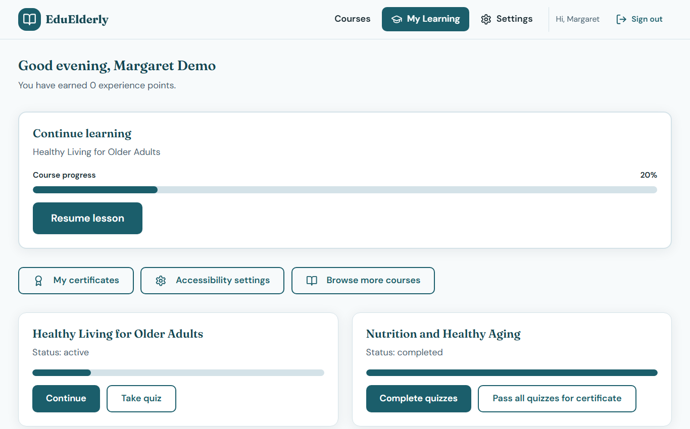
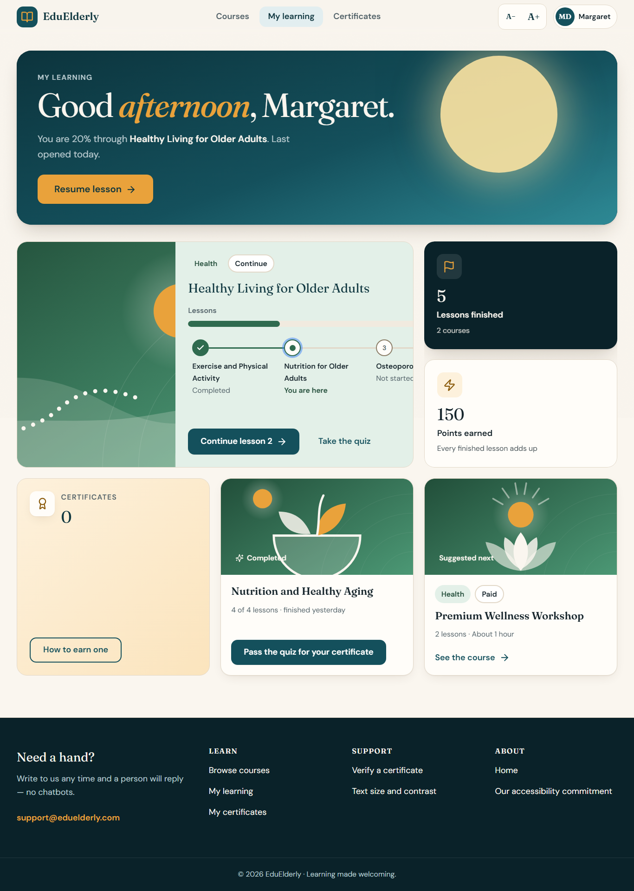
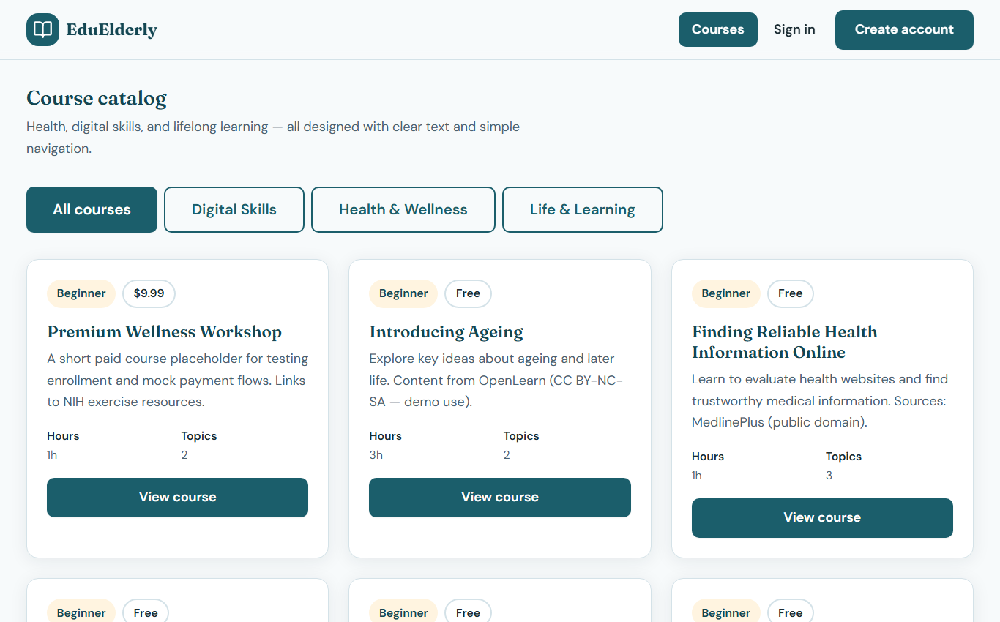
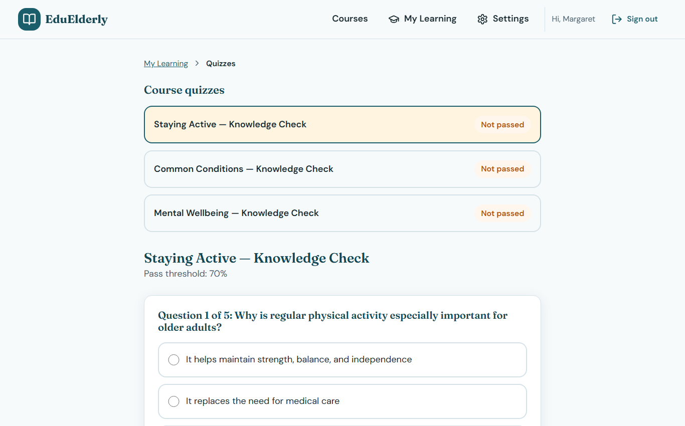
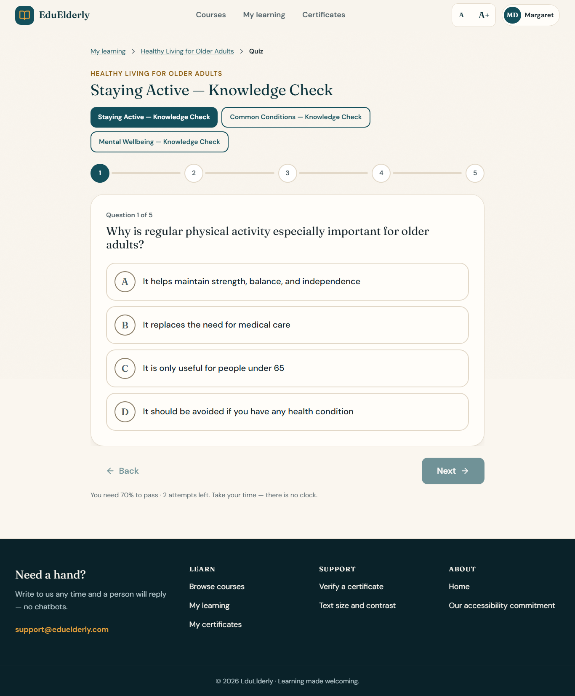

# EduElderly — Accessible Learning Platform

[](https://github.com/MAHIR-BABBAR/EduElderly/actions/workflows/ci.yml)
[](https://codecov.io/gh/MAHIR-BABBAR/EduElderly)


An accessible e-learning platform designed with an **elderly-first** approach, built as a microservices monorepo using Node.js, Express, MongoDB, and React.

## What it looks like

A warm, editorial interface built for readers over 60: paper surfaces, a colour "world" per subject, illustrated course covers, large type that scales with a one-tap control, and every screen checked at the largest text size, in high contrast and under reduced motion.

| Before | After |
|---|---|
|  |  |
|  |  |
|  |  |

Every route, at desktop and phone width: [`docs/screenshots/after/`](docs/screenshots/after/). Design decisions: [`DESIGN.md`](DESIGN.md); the implementation plan and security review: [`docs/NEXT-GEN-PLAN.md`](docs/NEXT-GEN-PLAN.md).

To reproduce the screenshots (and the accessibility gate behind them): `npm run walk -w packages/client` walks every route as the demo learner and admin, asserts one `h1` per page, scans each with axe-core, and fails on console errors or serious violations.

## Architecture Overview

EduElderly uses a **microservices architecture** with an API Gateway as the single entry point. The gateway verifies the JWT once and stamps `X-Gateway-Key` + `X-User-*` on proxied requests; services call each other over REST with a separate `X-Service-Key` on `/internal/*` routes. The request flow, the trust model and the internal route map are in [`docs/architecture.md`](docs/architecture.md); the reasoning behind the main choices is in [`docs/adr/`](docs/adr/).

```
┌─────────────┐
│   Client     │  React 18 + Vite
│  (port 5173) │
└──────┬───────┘
       │
┌──────▼───────┐
│  API Gateway  │  JWT validation, rate limiting, CORS, proxy
│  (port 8080)  │
└──────┬───────┘
       │
┌──────▼────────────────────────────────────────────────────┐
│                    Downstream Services                     │
├──────────────┬──────────────┬──────────────┬──────────────┤
│ auth :3001   │ user :3002   │ course :3003 │ enroll :3004 │
├──────────────┼──────────────┼──────────────┼──────────────┤
│ quiz :3005   │ payment:3006 │ notif :3007  │ admin :3008  │
├──────────────┴──────────────┴──────────────┼──────────────┤
│                                            │ cert :3009   │
└────────────────────────────────────────────┴──────────────┘
       │
┌──────▼───────────────────────────────┐
│  MongoDB (27017)  │  Redis (6379)     │
└───────────────────┴───────────────────┘
```

### Email flow (auth)

Auth does not send email directly. It calls the notification service, which delivers via Brevo:

```
Client → Gateway /api/v1/auth/* → Auth → POST notification:3007/internal/send
                                              (X-Service-Key)
                                        → Brevo API
```

Supported auth email types: OTP, email verification, password reset. Templates live in `services/notification/src/templates/`.

On successful email verification, auth also creates a user profile via `POST /users/create` on the user service.

## Gateway routing

Routing and public-route rules are defined in `services/gateway/routes.config.js`:

- **JWT validation** at the gateway for protected routes (`issuer: eduelderly`, `audience: eduelderly-client`).
- **Public auth routes** (no Bearer token): register, login, verify-email, forgot/reset password, resend verification, refresh, logout, verify/resend OTP.
- **Protected auth routes** (Bearer JWT required): change-password.
- **Gateway trust**: all downstream services require `X-Service-Key` in production (`GATEWAY_TRUST_ENFORCED=true`). Identity headers (`X-User-Id`, `X-User-Role`) are only trusted when the service key is valid.

## Service map

| Service | Port | Description |
|---------|------|-------------|
| **api-gateway** | 8080 | Entry point — routing, auth validation, rate limiting, CORS |
| **auth-service** | 3001 | Registration, login, OTP (Redis), JWT issue/refresh, password reset |
| **user-service** | 3002 | Profiles, accessibility preferences, roles |
| **course-service** | 3003 | Course/module/topic CRUD, media upload |
| **enrollment-service** | 3004 | Enrollments, progress, XP |
| **quiz-service** | 3005 | Quizzes, attempts, adaptive difficulty |
| **payment-service** | 3006 | Orders, HMAC verification, refunds |
| **notification-service** | 3007 | Transactional email (Brevo), internal `/internal/send` |
| **admin-service** | 3008 | Analytics, user management, audit logs |
| **certificate-service** | 3009 | PDF certificates on completion |

## Project structure

```
EduElderly/
├── packages/
│   ├── shared/                 # Constants, DTOs, errors, middleware
│   └── client/                 # React 18 + Vite frontend (Phase 8)
├── services/
│   ├── gateway/                # API Gateway (8080)
│   │   └── routes.config.js    # Proxy targets + public route rules
│   ├── auth/
│   │   └── src/
│   │       ├── controllers/    # HTTP handlers
│   │       ├── services/       # Registration, session, password, tokens, mail
│   │       ├── clients/        # notification + user HTTP clients
│   │       ├── utils/          # JWT + OTP helpers
│   │       └── routes/
│   ├── notification/
│   │   └── src/
│   │       ├── clients/        # Brevo API client
│   │       └── templates/      # Branded HTML email layouts
│   └── …                       # user, course, enrollment, quiz, payment, admin, certificate
├── docker-compose.yml          # MongoDB, Redis, all services
├── package.json                # npm workspaces root
└── jest.config.js
```

## Prerequisites

- **Node.js** >= 18
- **npm** >= 8 (workspace support)
- **Docker** & **Docker Compose** (recommended)
- **MongoDB** 7.x and **Redis** 7.x (included in Docker Compose)

## Getting started

### 1. Clone

```bash
git clone https://github.com/MAHIR-BABBAR/EduElderly.git
cd EduElderly
```

### 2. Environment variables

Copy `.env.example` to `.env` for each service you run:

```bash
cp services/gateway/.env.example services/gateway/.env

for service in auth user course enrollment quiz payment notification admin certificate; do
  cp "services/$service/.env.example" "services/$service/.env"
done
```

**Windows (PowerShell):**

```powershell
Copy-Item services\gateway\.env.example services\gateway\.env

$services = @("auth","user","course","enrollment","quiz","payment","notification","admin","certificate")
foreach ($s in $services) {
  Copy-Item "services\$s\.env.example" "services\$s\.env"
}
```

For local email testing, set `BREVO_API_KEY` and a verified `BREVO_SENDER_EMAIL` in `services/notification/.env`. Never commit `.env` files.

### 3. Install

```bash
npm install
```

### 4. Run with Docker Compose (recommended)

```bash
docker compose up --build
npm run demo:seed      # sample courses, quizzes, demo accounts, demo progress
npm run dev:client     # React client on http://localhost:5173
```

Demo accounts (created by `demo:seed`): learner `learner@demo.eduelderly` and admin `admin@demo.eduelderly`, both with password `Demo1234!`.

Starts MongoDB, Redis, backend services on the internal network, and the gateway on **8080**. All microservices run with `GATEWAY_TRUST_ENFORCED=true` (the gateway stamps `X-Gateway-Key` on every proxied request), matching production trust behavior.

If something else already listens on 8080 (some backup/agent software does), pick another host port and point the client's dev proxy at it:

```bash
GATEWAY_HOST_PORT=8081 docker compose up -d
VITE_GATEWAY_URL=http://localhost:8081 npm run dev -w packages/client
```

### 5. Run services locally (without Docker)

Ensure MongoDB and Redis are running. Copy `.env` files and use **localhost** URLs in `services/gateway/.env` (see `services/gateway/.env.example`). `JWT_ACCESS_SECRET` must match auth.

**Gateway trust (two keys):** Downstream services only accept identity headers (`X-User-Id`, `X-User-Role`) when the request carries the gateway's `X-Gateway-Key` (`GATEWAY_KEY`). Service-to-service `/internal/*` routes are guarded by a *different* secret, `X-Service-Key` (`INTERNAL_SERVICE_KEY`), which the gateway never holds — and the gateway returns 404 for any client request aimed at `/internal`, `/docs` or `/metrics` on a service. In production both checks are always enforced and services refuse to start if the two keys are equal; locally they are enforced when `GATEWAY_TRUST_ENFORCED=true`. If you run microservices directly on host ports (3001–3009) without the gateway in front, set `GATEWAY_TRUST_ENFORCED=true` in each service `.env` so spoofed headers cannot bypass auth.

**Dev compose note:** `docker-compose.yml` exposes MongoDB (`27017`) and Redis (`6379`) on the host for local tooling. These ports are **not** exposed in `docker-compose.prod.yml`. Do not use the dev compose Mongo/Redis exposure on any network-accessible machine.

Start core services (separate terminals):

```bash
cd services/auth && npm run dev
cd services/user && npm run dev
cd services/course && npm run dev
cd services/enrollment && npm run dev
cd services/gateway && npm run dev
```

Gateway loads `dotenv` before proxy setup so `COURSE_SERVICE_URL` / `ENROLLMENT_SERVICE_URL` apply correctly.

### 6. Health checks

```bash
curl http://localhost:8080/health
curl http://localhost:8080/health/auth
curl http://localhost:8080/health/course
curl http://localhost:8080/health/enrollment
```

Expected response shape:

```json
{
  "service": "<service-name>",
  "status": "healthy",
  "timestamp": "2025-01-01T00:00:00.000Z"
}
```

## Environment variables

### Gateway (`services/gateway/.env`)

| Variable | Default | Description |
|----------|---------|-------------|
| `PORT` | `8080` | Listen port |
| `JWT_ACCESS_SECRET` | — | Must match auth service (access token verification) |
| `INTERNAL_SERVICE_KEY` | — | Shared inter-service key |
| `AUTH_SERVICE_URL` | `http://auth:3001` | Auth service URL |
| `USER_SERVICE_URL` | `http://user:3002` | User service URL |
| `COURSE_SERVICE_URL` | `http://course:3003` | Course service URL |
| `ENROLLMENT_SERVICE_URL` | `http://enrollment:3004` | Enrollment service URL |
| `NOTIFICATION_SERVICE_URL` | `http://notification:3007` | Notification service URL |
| `CORS_ALLOWED_ORIGINS` | `http://localhost:5173` | Comma-separated CORS origins |
| `RATE_LIMIT_WINDOW_MS` | `60000` | Rate limit window |
| `RATE_LIMIT_MAX_REQUESTS` | `200` | Max requests per window |

See `services/gateway/.env.example` for all downstream service URLs.

### Auth (`services/auth/.env`)

| Variable | Description |
|----------|-------------|
| `MONGO_URI` | Auth database |
| `REDIS_URL` | OTP storage and attempt limits |
| `JWT_ACCESS_SECRET` / `JWT_REFRESH_SECRET` | Token signing |
| `APP_URL` | Frontend base URL for verification/reset links |
| `NOTIFICATION_SERVICE_URL` | Internal email dispatch |
| `USER_SERVICE_URL` | Profile creation after verify-email |
| `INTERNAL_SERVICE_KEY` | Must match gateway |

### Notification (`services/notification/.env`)

| Variable | Description |
|----------|-------------|
| `BREVO_API_KEY` | Brevo API key |
| `BREVO_SENDER_EMAIL` | Verified sender address in Brevo |
| `BREVO_SENDER_NAME` | Display name (default: EduElderly) |
| `INTERNAL_SERVICE_KEY` | Protects `/internal/send` |

### Enrollment (`services/enrollment/.env`)

| Variable | Description |
|----------|-------------|
| `MONGO_URI` | Enrollment database |
| `COURSE_SERVICE_URL` | Course stats + internal topic content |
| `USER_SERVICE_URL` | XP awards on progress |
| `PAYMENT_SERVICE_URL` | Paid enroll checkout (stub until Phase 5) |
| `INTERNAL_SERVICE_KEY` | Must match gateway |

### All backend services

| Variable | Description |
|----------|-------------|
| `PORT` | Service port (3001–3009) |
| `MONGO_URI` | MongoDB connection string |
| `INTERNAL_SERVICE_KEY` | Shared secret with gateway |

## API routes (via gateway)

| Prefix | Target | Auth |
|--------|--------|------|
| `/api/v1/auth/*` | auth | Public routes listed in `routes.config.js`; others require JWT |
| `/api/v1/users/*` | user | JWT required |
| `/api/v1/courses/*` | course | JWT required (public GET catalog) |
| `/api/v1/enrollments/*` | enrollment | JWT required (enroll, progress, content gate) |
| `/api/v1/quizzes/*` | quiz | JWT required |
| `/api/v1/payments/*` | payment | JWT required |
| `/api/v1/notifications/*` | notification | JWT required |
| `/api/v1/admin/*` | admin | JWT required (admin role) |
| `/api/v1/certificates/*` | certificate | JWT required |

## API documentation

Every service publishes an OpenAPI 3 document at `/docs.json` and a Swagger UI at `/docs` on its own port. The gateway aggregates all of them at **http://localhost:8080/docs** with a service picker, so one page covers the whole platform.

- Specs live in `services/<name>/src/docs/openapi.js` and are built with the helpers in `packages/shared/docs/openapi.js`, so error responses, pagination, and security schemes are declared once.
- Internal service-to-service routes are documented under the `Internal` tag with their Docker-network address; they are not reachable through the gateway.
- `npm run docs:validate` checks every operation has a summary, tags, security, and responses, and that every `$ref` resolves. CI runs it. `npm run docs:export` writes the JSON documents to `docs/openapi/`.
- In production the gateway docs require an admin JWT unless `DOCS_PUBLIC=true`.

## Caching and observability

- **Catalog cache.** The course service caches public catalog reads (`GET /courses`, `GET /courses/:id`, internal stats) in Redis for 60 s and answers with `X-Cache: HIT|MISS`. Every write to courses, modules, topics, or categories invalidates the `course:` prefix, so admins never see stale data. Without Redis the service simply reads from Mongo.
- **Metrics.** The gateway exposes Prometheus metrics at `/metrics`: process defaults plus `http_requests_total` and `http_request_duration_seconds` labelled by service prefix, method, and status (never full paths, so cardinality stays bounded).
- **Request ids.** Every request gets an `X-Request-ID` that the gateway forwards to services and services echo back; logs from every service are JSON lines carrying it.

## Payments

Payments go through a provider adapter (`services/payment/src/providers/`) so the order state machine never depends on a specific vendor:

| `PAYMENT_PROVIDER` | Checkout | Confirmation |
|--------------------|----------|--------------|
| `mock` (default in dev) | Fake checkout URL | Learner self-confirm button, or an HMAC-signed fake webhook |
| `razorpay` | Razorpay Orders API (amount in paise, our order id in `notes`) | Razorpay webhook signed with the webhook secret |
| `none` (default in prod) | Refused with 503 until a provider is configured | — |

Rules that hold for every provider:

- Orders move `pending → success | failed` and `success → refunded` only; invalid transitions are rejected.
- `POST /api/v1/payments/webhook` is public but verifies an HMAC-SHA256 signature over the raw request body before doing anything.
- A capture **enrolls the learner first, then marks the order paid**. If enrollment fails the order stays pending and the webhook returns 5xx so the provider retries.
- Webhooks are idempotent: a replay or a capture for an already-paid order returns `duplicate: true` and never enrolls twice.

## Async jobs (BullMQ)

Two side effects are slow and failure-prone, so they run off the request path on Redis-backed BullMQ queues:

| Queue | Service | Job | Fallback without Redis |
|-------|---------|-----|------------------------|
| `email` | notification | Deliver a persisted notification via Brevo | Sent inline |
| `certificate-pdf` | certificate | Pre-render and store the certificate PDF | Rendered inline at issue; downloads regenerate on demand |

- Every job retries 5 times with exponential backoff (2 s to 32 s); failed jobs are kept for 7 days.
- Processors are idempotent (job id = record id; already-sent or already-rendered records are skipped) so a retry after a partial success is safe.
- Queue counts appear on the admin dashboard and at each service's `/internal/queue/stats`.
- `QUEUE_ENABLED=false` forces inline mode; tests run inline by default and the queue integration test runs when `REDIS_URL` is set.

## Enrollment flow (Phase 3)

Learners enroll through the enrollment service; topic `contentUrl` is **not** exposed on public course APIs.

```
Client → Gateway /api/v1/enrollments → Enrollment
              │                              │
              │                              ├─ GET course stats (course :3003)
              │                              ├─ POST checkout (payment :3006) — paid only
              │                              ├─ Award XP (user :3002) — on progress
              │                              └─ GET topic content (course internal /internal/topics/:id)
```

| Action | Endpoint | Notes |
|--------|----------|-------|
| Enroll (free) | `POST /api/v1/enrollments` | Body: `{ "courseId" }` → `201` |
| Enroll (paid) | `POST /api/v1/enrollments` | → `202` + `{ requiresPayment, checkout }` (payment service stub) |
| List enrollments | `GET /api/v1/enrollments` | Current user |
| Resume learning | `GET /api/v1/enrollments/:id/resume` | Next topic + position |
| Mark progress | `PATCH /api/v1/enrollments/:id/progress` | Body: `{ "topicId" }` |
| Content gate | `GET /api/v1/enrollments/:id/topics/:topicId/content` | Returns `contentUrl` for enrolled learners only |
| Drop | `DELETE /api/v1/enrollments/:id` | Soft drop |

See `services/enrollment/README.md` for internal routes (`/internal/enroll` after payment).

## Shared package (`@eduelderly/shared`)

- **Constants**: roles, content types, difficulty, transaction types, `enrollmentStatus`, `xpRewards`
- **Errors**: `AppError`, `ERROR_CODES`
- **Middleware**: `globalErrorHandler`, `catchAsync`, `serviceAuth`
- **DTOs**: public user/course/enrollment shapes (`contentUrl` stripped from public course topics)

```javascript
const { AppError, ERROR_CODES, globalErrorHandler, catchAsync } = require('@eduelderly/shared');
```

## Testing

All backend services have Jest + Supertest suites. Each microservice runs two Jest projects: **integration** (MongoDB-backed API tests) and **security** (gateway-trust header spoofing, no DB required). Gateway tests run without Mongo.

Start Mongo before integration tests:

```bash
docker compose up -d mongo
```

Run per service (`npm test` runs both projects):

| Service | Tests |
|---------|-------|
| auth | 25 |
| user | 28 |
| payment | 38 |
| course | 18 |
| enrollment | 21 |
| quiz | 13 |
| admin | 9 |
| notification | 19 |
| certificate | 17 |
| gateway | 28 |
| **Total** | **216** |

```bash
cd services/auth && npm test
cd services/gateway && npm test
# … repeat for user, course, enrollment, quiz, payment, notification, admin, certificate
```

Integration tests default to `mongodb://127.0.0.1:27017/eduelderly-*-test`. Security tests use a lightweight setup and do not require Mongo.

Root `npm test` runs all workspaces (`npm run test --workspaces --if-present`).

**Windows note:** auth/user tests use a real MongoDB URI (`TEST_MONGO_URI`) because MongoMemoryServer can fail with `spawn EFTYPE`. Example:

```powershell
$env:TEST_MONGO_URI="mongodb://127.0.0.1:27017/eduelderly-auth-test"
cd services/auth; npm test
```

## Development scripts

| Command | Description |
|---------|-------------|
| `npm test` | Run tests in all workspaces |
| `npm run dev:client` | Start React frontend (Vite, port 5173) |
| `docker compose up --build` | Build and start stack |
| `docker compose down` | Stop stack |
| `docker compose logs -f gateway` | Follow gateway logs |

## Production deployment

1. Copy `.env.prod.example` to `.env.prod` and set strong `MONGO_ROOT_PASSWORD`, `REDIS_PASSWORD`.
2. Copy each service `.env.example` to `.env` and set production secrets (`INTERNAL_SERVICE_KEY`, JWT secrets, `CORS_ALLOWED_ORIGINS`).
3. Build and start:

```bash
docker compose -f docker-compose.prod.yml --env-file .env.prod up -d --build
```

Production posture:

- Only the gateway is exposed on the host (`GATEWAY_PORT`, default 8080).
- MongoDB and Redis have no host ports; Redis and Mongo require authentication.
- `GATEWAY_TRUST_ENFORCED=true` on all services — direct calls without `X-Service-Key` are rejected.
- Payment amounts are validated server-side against course prices.
- Payment confirmation enrolls the learner before marking the order paid.

## Build phases

| Phase | Focus | Status |
|-------|-------|--------|
| **0** | Monorepo, Docker, shared, gateway | Done |
| **1** | Auth — register, OTP, login, JWT, password reset, email via Brevo | Done |
| **2** | User + course services | Done |
| **3** | Enrollment + XP, content gate, paid-checkout delegate | Done |
| **4** | Quiz service | Done |
| **5** | Payment service | Done |
| **6** | Notification + certificate | Done |
| **7** | Admin service | Done |
| **8** | Frontend (React) | Done |
| **9** | Production hardening + deploy | Done |

## Tech stack

- **Runtime**: Node.js 20 (Alpine in Docker)
- **Framework**: Express 5
- **Database**: MongoDB 7 (Mongoose)
- **Cache**: Redis 7 (OTP / rate-style limits)
- **Gateway**: http-proxy-middleware, JWT validation
- **Auth**: JWT access + refresh, bcrypt, Redis-backed OTP
- **Email**: Brevo (transactional)
- **Payment**: Razorpay (primary), Stripe (fallback)
- **Media**: Cloudinary / AWS S3
- **Frontend**: React 18 + Vite
- **Testing**: Jest + Supertest
- **Linting**: ESLint + Prettier
- **Containers**: Docker Compose

## License

ISC
