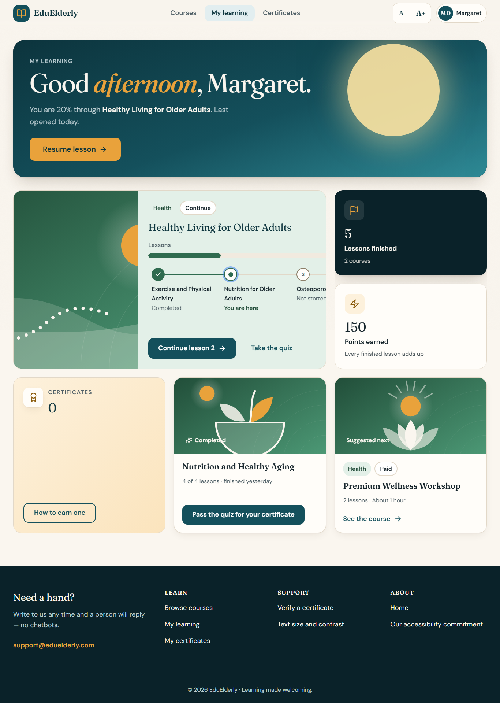
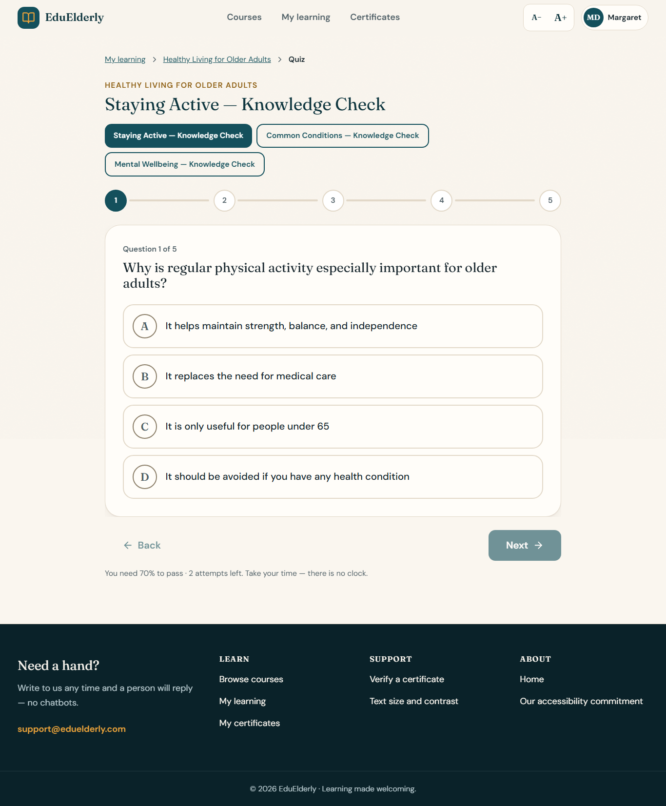

# EduElderly

[](https://github.com/MAHIR-BABBAR/EduElderly/actions/workflows/ci.yml)

An online learning platform designed for older adults: large readable text, a one-tap text-size control, high-contrast mode, and simple step-by-step lessons and quizzes that end in a verifiable certificate.



| Catalog | Quiz |
|---|---|
|  |  |

## What it does

- **Learners** browse courses, enrol (free or paid), watch video lessons, track progress, take quizzes and earn a PDF certificate with a public verify link.
- **Admins** manage courses, quizzes, users and orders from a separate console.
- **Accessibility first**: text size and contrast preferences are saved to the account, and every page passes an automated WCAG AA accessibility scan.

## How it's built

A React front end talks to one API gateway, which routes to small Node.js services, each with its own MongoDB database.

```
React app ──▶ API gateway ──▶ auth · user · course · enrollment · quiz
                               payment · notification · certificate · admin
                                      │
                               MongoDB  ·  Redis
```

- **Gateway** checks the login token once and forwards requests to the right service.
- **Services** talk to each other through internal routes that the public can't reach.
- **Redis** caches the course catalogue and runs background jobs (emails, certificate PDFs).

More detail: [`docs/architecture.md`](docs/architecture.md) · design decisions: [`docs/adr/`](docs/adr/)

**Stack:** React, Vite, Tailwind · Node.js, Express · MongoDB · Redis · Docker · Jest, Vitest, Playwright · GitHub Actions

## Run it locally

Requires Node.js 24 and Docker.

```bash
git clone https://github.com/MAHIR-BABBAR/EduElderly.git
cd EduElderly
npm install
docker compose up --build -d
npm run demo:seed
npm run dev:client          # http://localhost:5173
```

Demo logins (password `Demo1234!`): `learner@demo.eduelderly`, `admin@demo.eduelderly`

## Tests

```bash
npm test                              # every service and the client
npm run walk -w packages/client       # clicks through every page + accessibility scan
```

CI runs lint, all test suites and Docker builds on every push.

## License

ISC
